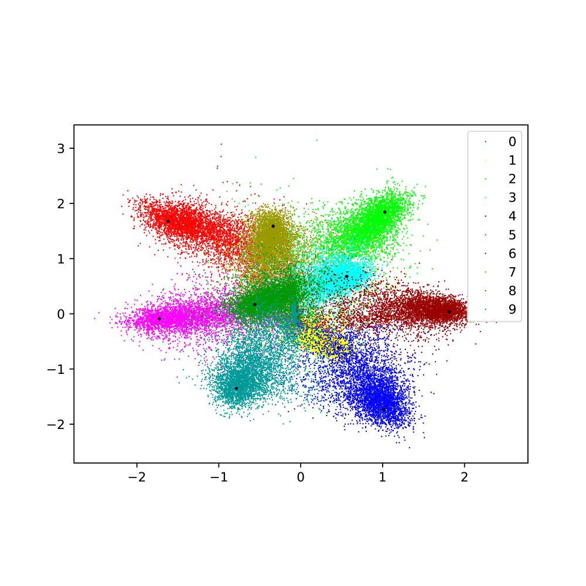

# RBF-Softmax


[RBF-Softmax](https://www.ecva.net/papers/eccv_2020/papers_ECCV/papers/123710290.pdf) is a simple but effective image classification loss function of deep neural networks. This RBF-Softmax project written in [PyTorch](https://pytorch.org/) and modified from [pycls](https://github.com/facebookresearch/pycls).


<div align="center">
  
  <p align="center"><b>RBF-Softmax</b> The MNIST toy demo visualization of RBF-Softmax and other losses.</p>
</div> 


<div align="center">
  
  <p align="center"><b>RBF-Softmax Pipeline</b> In RBF-Softmax, logits are calculated by RBF kernel and then scale by a hyperparameter. So here the weights in last FC are treated as class prototypes.</p>
</div> 


Following gif is the 2D feature visualization of RBF-Softmax trained on MNIST. With the training conducting, the inner class distances become smaller and smaller.
<div align="center">
  
  <p align="center"><b>Feature Vis.</b> </p>
</div> 


## Introduction


## Training and Testing RBF-Softmax

- Since RBF-Softmax use [pycls](https://github.com/facebookresearch/pycls) as codebase, most of the installation follows pycls. Please refer [`INSTALL.md`](docs/INSTALL.md) for installation instructions. 

- After installation, please see [`GETTING_STARTED.md`](docs/GETTING_STARTED.md) for basic instructions and example commands on training and evaluation with **RBF-Softmax**.

## Model Zoo

We provide a some final results and pretrained models available for download in the [Model Zoo](docs/MODEL_ZOO.md). Note in paper we report the best top-1 performances during whole training.

<div align="center">
  
  <p align="center"><b>ImageNet Results</b> The best top-1 error of different models trained with RBF-Softmax.</p>
</div> 


## Citing

If you find **RBF-Softmax** helpful in your research, please consider citing:

```
@InProceedings{xzhang2020rbf,
  title = {RBF-Softmax: Learning Deep Representative Prototypes with Radial Basis Function Softmax},
  author = {Zhang, Xiao and Zhao, Rui and Qiao, Yu and Li, Hongsheng},
  booktitle = {ECCV},
  year = {2020}
}
```

## License

**RBF-Softmax** is licensed under the MIT license. Please see the [LICENSE](LICENSE) file for more information.

